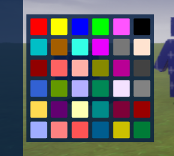
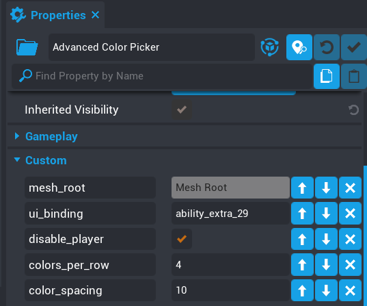
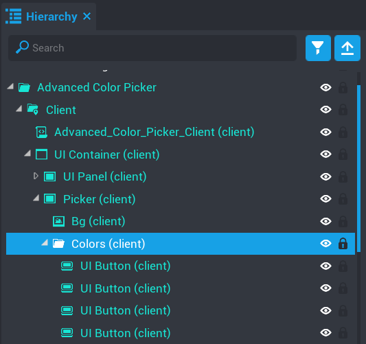

# Modifying the Palette

The color palette is built in such a way that you can add and modify colors and the component will dynamically create the palette for you.  This saves you from having to place each color by hand in the palette.

The component contains 2 custom properties to handle how many colors appear per row and the spacing between them.

- `colors_per_row`

	The amount of colors on each row of the palette.

- `color_spacing`

	The spacing around the edge of the panel and between each color.

You can also easily add more colors by adding more buttons to the palette.

