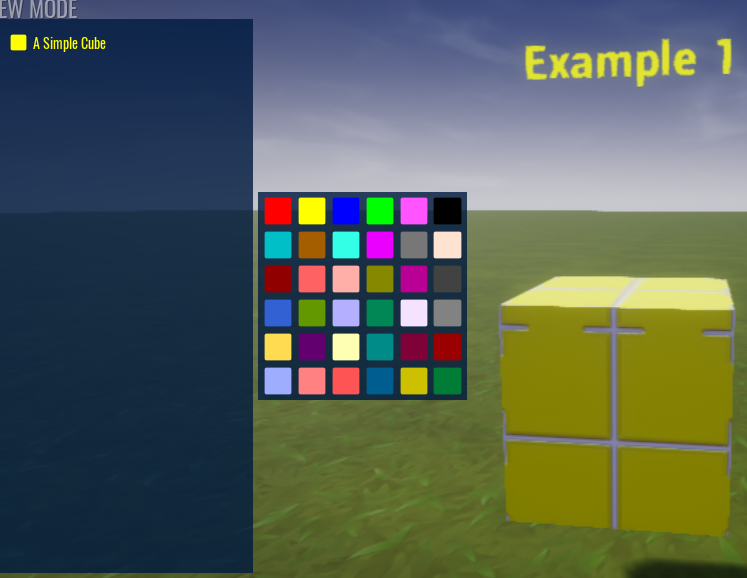

# A Simple Cube

Drag the `Mesh Root` folder onto the `mesh_root` property of the Advanced Color Picker component.

Enter play mode and press `P`.  You will be able to pick the Cube and change the color of it.

