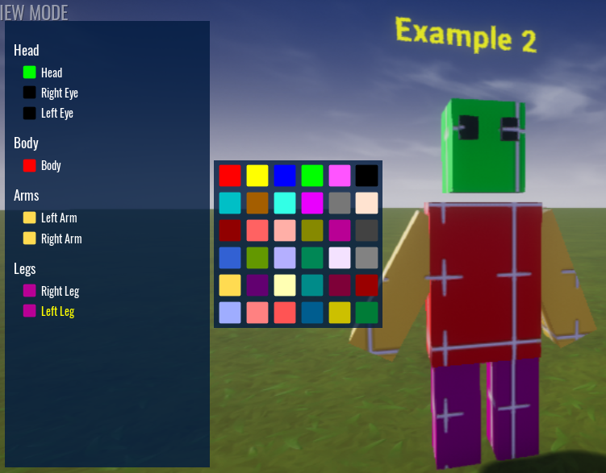

# Multiple Mesh Objects

This example shows you how good naming of your mesh objects and folders can help with identifying which part is being colored in the Color Picker Hierarchy.

As with the previous example, remember to set the `mesh_root`.

Enter play mode and press `P` and begin coloring each part of the character.

