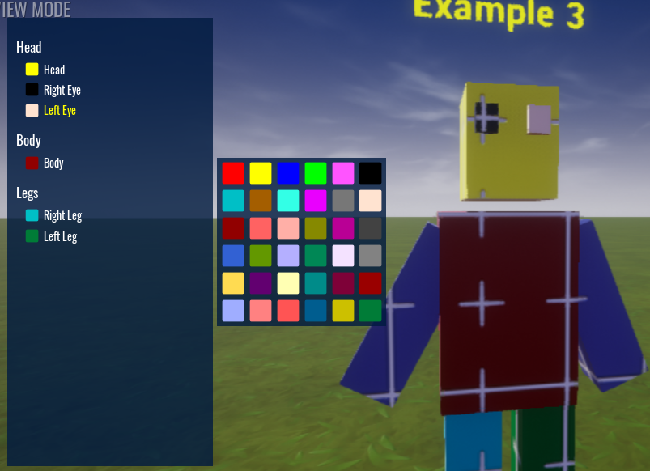

# Ignoring Mesh Objects

In this example it shows how we can use the ignore feature.

Expand the Mesh Root folder and look at the `Arms` folder.  You will see a custom property called `ignore_color_picker`.  What this does is tells the Advanced Color Picker to ignore this object and anything that is a child of it.

When you run the example, you will see the arm mesh objects will not be visible in the UI to be colored.

