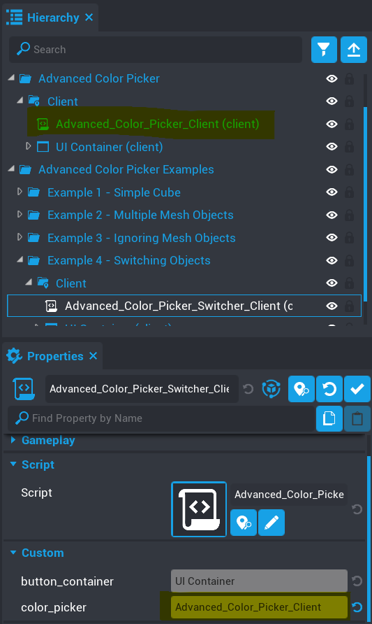
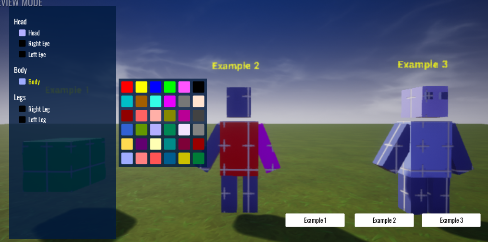

# Object Switching

This example shows you how to handle object switching.  Once setup, you will be able to switch between the first 3 examples by clicking on the example buttons.

Expand the `Client` folder under the `Advanced Color Picker` folder and take a look the custom properties on the `Advanced_Color_Picker_Switcher_Client` script.

It's important that this script has a reference to the `Advanced_Color_Picker_Client` script so we can call the `set_mesh_root` method.  

Enter play mode and press `P`.  You will be able to click on the buttons and switch between the first 3 examples.

