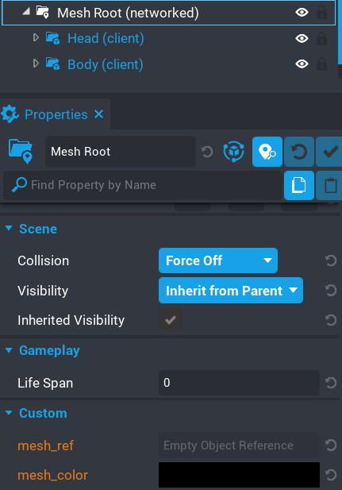

# Syncing Colors with Clients

This example shows you one method of syncing the color picked from one client to all the other clients in the game so they can also see the changed color.

Enter multiplayer preview mode with at least 2 players, and with one player modify the colors of Example 6 objects.


You should see in the other clients window that the colors are being synced to them as well.

There are quite a few ways you can handle this.  In this example I will be using networked properties.

Take a look at the `Mesh Root` folder.  You will see there are 2 networked properties.



 - **`mesh_ref`**  
   When a mesh has changed color, the server will set this property to the reference of the mesh.  

 - **`mesh_color`**  
   The server will also set the value of this property to the color that the mesh needs to be.

There is an event we can connect to that is broadcasted from the Advanced Color Picker called `on_color_picker_object_changed`.  When a client changes the color of a mesh, this is broadcasted and any script that connects to this event will receive 3 parameters.

 - **Current Mesh Id**  
   The Id of the mesh that has been modified.

 - **Color**    
   The color the mesh was modified too.

 - **Current Mesh**  
	The actual mesh object that is being modified

What this example does is listens for the event `on_color_picker_object_changed` and then broadcasts to the server the mesh reference and color.  The server will listen for the event and then set the networked property of the `Mesh Root`.

Let's look at the scripts to see just how easy this is to implement.

Here is the client script that handles sending the data to the server, and listening for when the networked properties get changed.

## Client Script

```lua
-- Reference to the Mesh Root object so we can set the read the properties later on.

local mesh_root = script:GetCustomProperty("mesh_root"):WaitForObject()

-- Broadcasted from the Color Picker script.  We then broadcast to the server.

Events.Connect("on_color_picker_object_changed", function(mesh_id, color, mesh)
	Events.BroadcastToServer("on_color_picker_sync", mesh:GetReference(), color)
end)

-- Look for property changes, if it matches the "mesh_color" property, we then change the color.

mesh_root.networkedPropertyChangedEvent:Connect(function(obj, prop)
	if(prop == "mesh_color") then
		mesh_root:GetCustomProperty("mesh_ref"):GetObject():SetColor(mesh_root:GetCustomProperty("mesh_color"))
	end
end)
```

We listen for when the property `mesh_color` changes.  Since this is the last property to get updated, we will already have the `mesh_ref` set.  If we do this in reverse, then `mesh_color` would be black.

## Server Script

Finally the server script which updates the networked properties.

```lua
local mesh_root = script:GetCustomProperty("mesh_root"):WaitForObject()

Events.Connect("on_color_picker_sync", function(mesh_ref, color)
	mesh_root:SetNetworkedCustomProperty("mesh_ref", mesh_ref)
	mesh_root:SetNetworkedCustomProperty("mesh_color", color)
end)
```

Networked properties are really useful in this case.  It doesn't take a lot of code to get everything synced up between clients.  There are other methods you can take, but for ease I recommend this method.