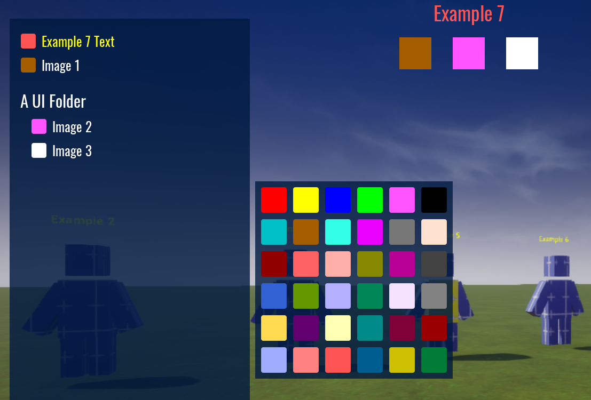

# UI Coloring

This example shows you that some UI components can be modified as well.

The suported UI elements are:

  - `UI Image`
  - `UI Text`

For folder support, you can use `UI Panel`.

It's important to note that the `Mesh Root` in this case is a `UI Container` (in the example it is called `UI Root`).  Look at the example folder structure to see how to set it up yourself.

Enter play mode and press `P`.  You should see a list of the UI elements that can be modified.  

The setup is pretty much like `Mesh Objects` only using UI components.

