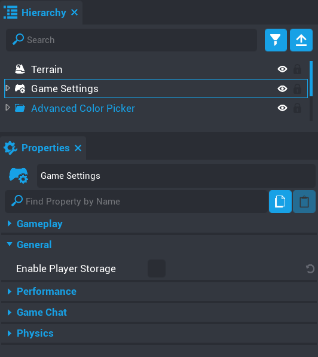
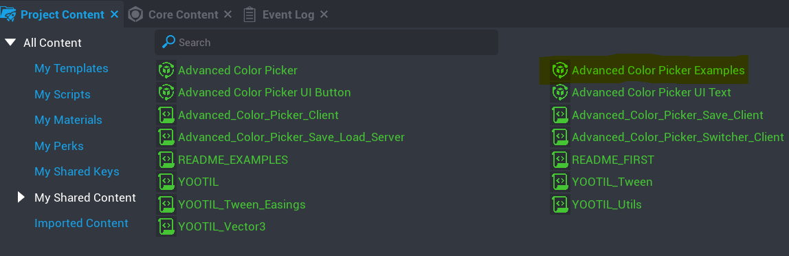
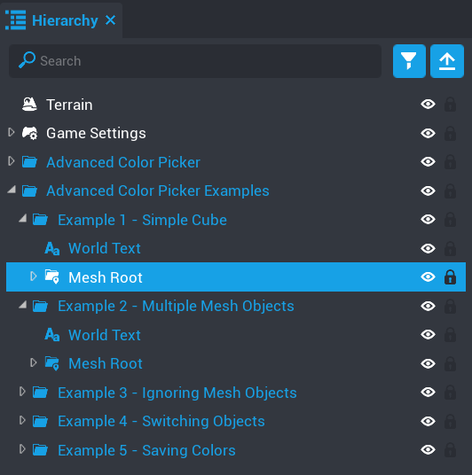

# Trying the Examples

To try out the examples you need to do 2 important things first.

1. Enable `Player Storage` on your Game Settings object (use in a later example).

	

2. Drag and drop the `Advanced Color Picker Examples` component into the hierachy.

	

&nbsp;

For all examples you need to drag the the `Mesh Root` folder onto the `mesh_root` of the Advanced Color Picker component object for each
one you want to test.

