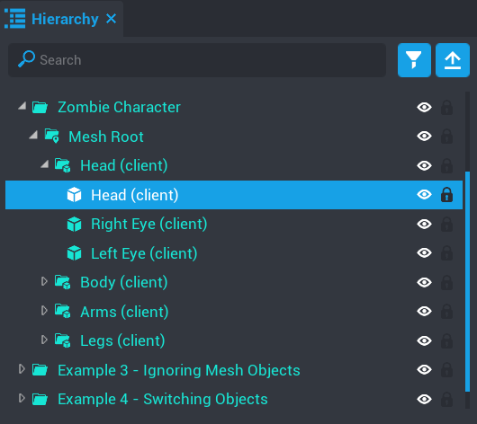
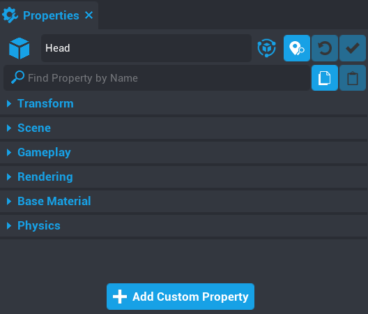
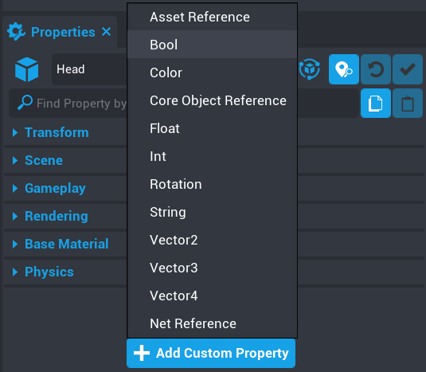
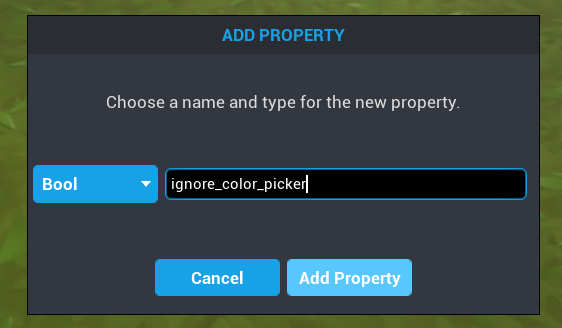
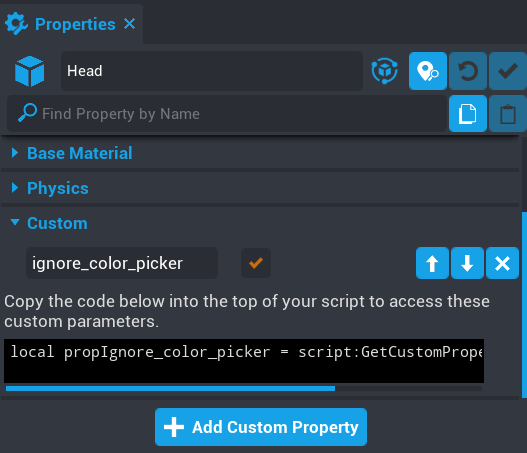
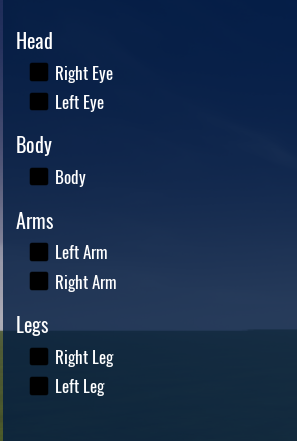

# Ignoring Mesh Objects

In some cases you may not want specific mesh objects or groups of mesh objects to be colored.  This is very easy to do by using custom properties.

For any mesh object or folder of mesh objects, you can apply a custom property called `ignore_color_picker`.  When ticked, this will tell the component that this mesh object or folder of mesh objects needs to be ignored.

In this example I want to disable the `Head` from being colored, but still allow the eyes to be colored.

Click on the object to make it active.

In the properties panel at the bottom, you will see a button called `Add Custom Property`.

Click on the button and add a `Bool` property.

A window will popup where you need to name the custom property.  In this case the name of the property needs to be `ignore_color_picker`.

The new property will now show up.  Click the checkbox to enable it.  The component will see this property and if it is ticked then this mesh object or folder of mesh objects will be ignored.

So now if I look at my color picker hierarchy, the Head will no longer be an option to color.

