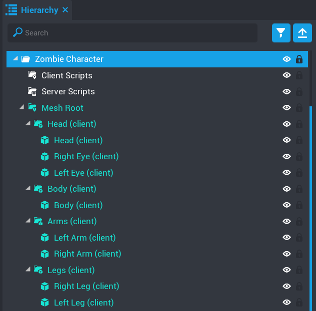
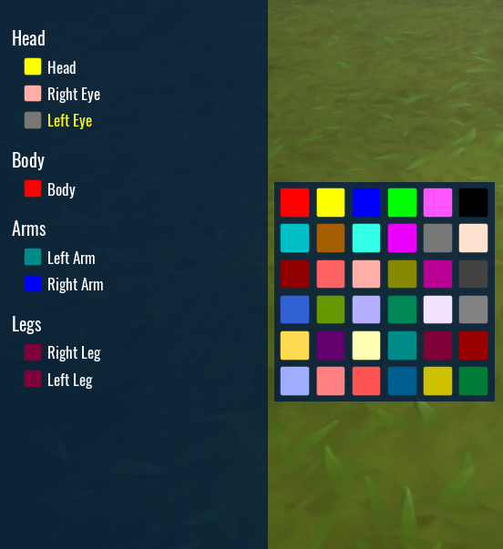

# Setup Mesh Objects

Your mesh objects should be in a folder that will be the `mesh_root` (container).  

An example of an ideal structure for a character.

The thing to take away from the image above is good naming of each mesh object.  It's recommended because the name of the mesh object is used in the hierarchy of the color picker.

Take a look at the color picker hierarchy below.  Players will be able to easily identify which part of the object they are coloring.

