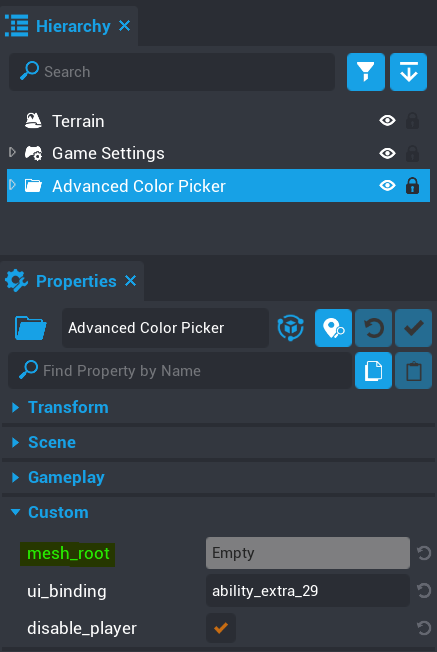

# Mesh Root

The most important thing you need to know about this component is to set the `mesh_root` property.  If you don't do this, then the component will not be able to find mesh objects and display them in the list to be colored.

With the component added to the Hierarchy click on it to make it the focused object.  In the properties panel you will see custom properties, one being `mesh_root`.  This is where you need to drag your mesh root folder to.

